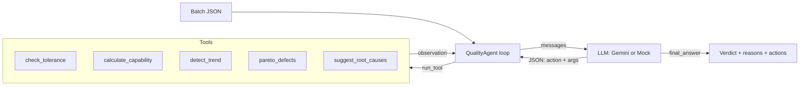

# Manufacturing Quality Inspection Agent (Agentic AI)

An autonomous agent that inspects a production batch and decides **ACCEPT / REJECT**.
It plans its own steps, calls tools (SPC and quality calculations), reads the results, and writes a
report with reasons and corrective actions. Built around real shop-floor quality work: tolerance
checks, Cp/Cpk, drift detection, Pareto analysis and root-cause (5-Why) starters.

## Why it is "agentic"
The LLM is not asked for one answer. It runs in a loop: it **reasons**, **chooses a tool**, **observes
the result**, and repeats until it can justify a decision. It recovers from tool errors and stops at a
step limit, escalating to a human if it cannot decide.

## Architecture



Full tool and message schema: [`schema/tools_schema.json`](schema/tools_schema.json).

## Project layout
```
agent/agent.py   reasoning loop (Reason -> Act -> Observe)
agent/tools.py   5 quality tools + safe executor
agent/llm.py     GeminiLLM (real) and MockLLM (offline)
schema/          tool + protocol schema
sample_data/     good and bad example batches
tests/           pytest suite
main.py          CLI
```

## Run it
No dependencies beyond Python 3.9+.

```bash
# Offline demo (no API key needed)
python main.py --mock
python main.py --mock --data sample_data/batch_ok.json

# With a real LLM (Gemini)
export GEMINI_API_KEY="your-key"     # Windows PowerShell: $env:GEMINI_API_KEY="your-key"
python main.py

# Tests
pip install pytest && pytest -q
```

## Decision rule
ACCEPT only if no part is out of tolerance, Cpk >= 1.33, and no drift is detected.

## Security
API keys are read from the `GEMINI_API_KEY` environment variable only. `.env` is git-ignored.
Never commit a key.

## Author
Utkarsh Banerjee, VIT Chennai
